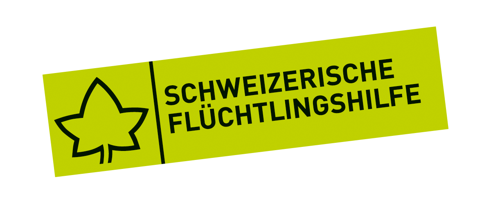

  
  <h1>Bridging Justice: Accessible, Reliable, and Collaborative AI for Law (ARCL)</h1>

## Problem statement

Access to justice is a global challenge. From complex legal language to high costs of representation, barriers to the accessibility of law are multifold, often leaving specifically underserved communities and people in need in challenging situations. To address the needs especially of migrants and individuals with lower economic status and to “bridge justice”, research on legal artificial intelligence (AI) tools supporting laypersons as well as resource-constrained legal professionals working in legal aid are needed. Our proposed project **Bridging Justice: Accessible, Reliable, and Collaborative AI for Law (ARCL)** builds on top of our recent research in this field to develop, validate, test, and deploy legal AI tools for Swiss law for underserved communities with the goal of increasing access to law.

## Objectives

ARCL aims at scientific impact and its translation into practical implementation and use that aids society. First, we examine barriers to access to law by drawing on computational law techniques and social science methods. To mitigate these barriers, we develop, validate, and deploy accessible and reliable legal AI tools in partnership with Caritas Switzerland. For broad coverage, our two concrete use cases are aimed at legal professionals and laypersons, respectively. We next study how laypersons and legal professionals interact with the developed tools and measure their impact in the scope of the two use cases. Finally, we publicly deploy our tools to generate sustained societal impact. Across these steps, we synthesize design principles for effective human-AI collaboration in the legal domain.

## Partners

<table>
  <tr>
    <td align="center" width="50%">
       
      <b>Universität St.Gallen</b>
    </td>
    <td align="center" width="50%">
       
      <b>University of Lausanne</b>
    </td>
  </tr>
  <tr>
    <td align="center" width="50%">
       
      <b>Caritas Switzerland</b>
    </td>
    <td align="center" width="50%">
       
      <b>Swiss Refugee Council (OSAR)</b>
    </td>
  </tr>
</table>
